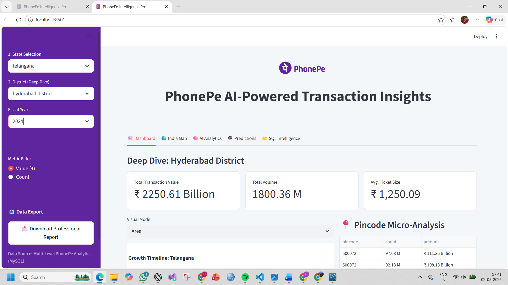

# 📱 PhonePe AI-Powered Transaction Insights

## 🚀 Overview

**PhonePe AI-Powered Transaction Insights** is an interactive data analytics dashboard built using Streamlit that provides deep insights into digital transaction patterns across India. The application integrates data visualization, SQL-based data processing, and machine learning to deliver meaningful business intelligence.

This project demonstrates end-to-end data handling — from data extraction and storage to analysis, visualization, and predictive modeling.

---

## 🎯 Objectives

* Analyze transaction trends across different states and years
* Provide interactive dashboards for business insights
* Visualize geographical distribution of transactions across India
* Predict future transaction trends using machine learning

---

## 📊 Key Features

### 📍 Interactive Dashboard

* Dynamic filters for **State** and **Year**
* Clean and professional UI design

### 📈 Data Visualization

* Yearly transaction trends (Line / Bar / Area charts)
* Category-wise distribution (Pie / Bar charts)
* Top-performing states analysis

### 🌍 India State-wise Map

* Colorful choropleth map for geographic insights
* State-level transaction comparison

### 🧠 Machine Learning

* Linear Regression model for future prediction
* Forecasts upcoming transaction trends

### 📥 Data Export

* Download filtered dataset as CSV

---

## 🛠️ Tech Stack

| Category        | Tools Used                  |
| --------------- | --------------------------- |
| Programming     | Python                      |
| Database        | MySQL                       |
| Visualization   | Plotly, Matplotlib, Seaborn |
| Dashboard       | Streamlit                   |
| ML Model        | Scikit-learn                |
| Version Control | Git & GitHub                |

---

## 📂 Project Structure

```
PhonePe-Transaction-Insights/
│
├── app/
│   └── app.py                # Main Streamlit dashboard
│
├── data/
│   └── aggregated_transaction.csv
│
├── scripts/
│   ├── data_extraction.py
│   └── load_to_sql.py
│
├── sql/
│   ├── schema.sql
│   └── queries.sql
│
├── analysis.py              # Data analysis script
├── requirements.txt
└── README.md
```

---

## ⚙️ Installation & Setup

### 1️⃣ Clone the Repository

```bash
git clone https://github.com/HeenaKousar08/PhonePe-Transaction-Insights.git
cd PhonePe-Transaction-Insights
```

### 2️⃣ Install Dependencies

```bash
pip install -r requirements.txt
```

### 3️⃣ Setup Database

* Create MySQL database named `phonepe`
* Run SQL scripts from `/sql` folder
* Load data using `load_to_sql.py`

### 4️⃣ Run the Application

```bash
streamlit run app/app.py
```


## 📈 Business Insights

* Rapid growth in digital transactions across recent years
* Significant contribution from top states like Maharashtra, Karnataka, and Telangana
* Category-level analysis helps identify high-performing sectors
* Predictive analytics provides foresight into future transaction trends

---

## 🔮 Future Enhancements

* Add real-time data integration
* Implement anomaly detection models
* Enhance UI with advanced animations
* Deploy dashboard to cloud platform
* Add district-level insights

---
## 📸 Dashboard Preview

### 🔹 Main Dashboard


## 👩‍💻 Author

**Heena Kousar**
Aspiring Data Analyst | Python | SQL | Machine Learning

---

## 📜 License

This project is open-source and available under the MIT License.

---

## ⭐ Support

If you like this project, consider giving it a ⭐ on GitHub!
