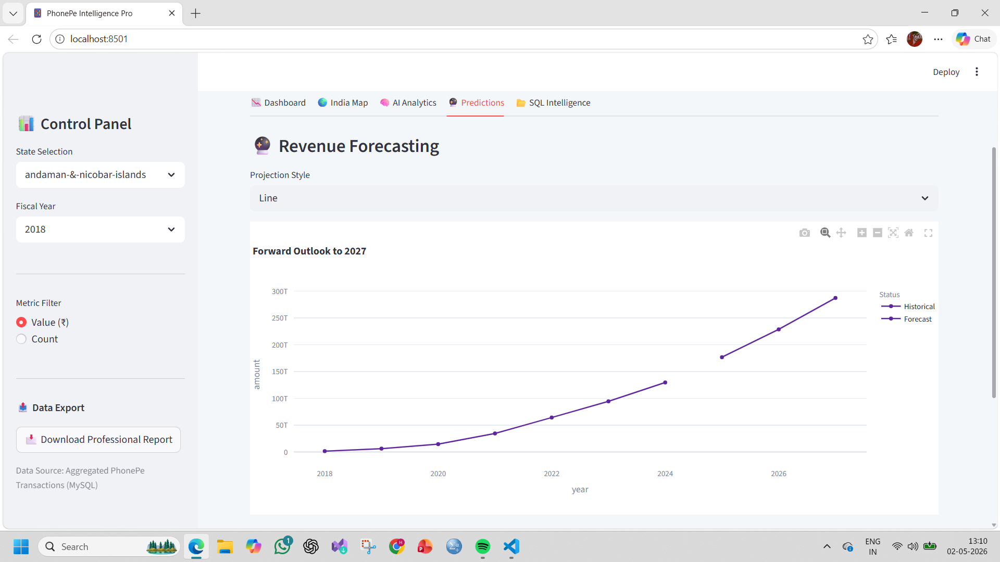

# 📱 PhonePe AI-Powered Transaction Insights


A full-stack **data analytics dashboard** built using **Streamlit, MySQL, and Machine Learning**, designed to analyze and visualize PhonePe transaction data across India.

---

## 🚀 Project Overview

This project provides a **multi-level analytics platform** to explore:

- 📊 State & District level transaction insights
- 🌍 Interactive India Map visualization
- 🧠 AI-based market segmentation
- 🔮 Future transaction predictions
- 📂 SQL-powered business intelligence

---

## 🎯 Business Objective

To help stakeholders:
- Identify **high-performing regions**
- Detect **growth trends**
- Understand **user behavior patterns**
- Make **data-driven decisions**

---

## 🧰 Tech Stack

- **Frontend:** Streamlit
- **Backend:** Python
- **Database:** MySQL
- **Visualization:** Plotly
- **Machine Learning:** Scikit-learn
- **Data Processing:** Pandas

---

## 📂 Project Structure

PhonePe-Transaction-Insights/
│
├── app/
│ └── app.py
│
├── scripts/
│ └── load_to_sql.py
│
├── assets/
│ ├── dashboard.png
│ ├── map.png
│ ├── prediction.png
│
├── india_states.geojson
├── requirements.txt
└── README.md


---

## ⚙️ Features

### 📉 Dashboard
- State → District drill-down
- Transaction value & volume metrics
- Growth trend visualization

### 🌍 India Map
- Choropleth map using GeoJSON
- State-wise transaction comparison

### 🧠 AI Analytics
- K-Means clustering
- District segmentation into tiers

### 🔮 Predictions
- Polynomial Regression forecasting (till 2027)

### 📂 SQL Intelligence
- Top states by revenue
- Category-wise performance

---

## 🖼️ Screenshots

### 📊 Dashboard


### 🌍 India Map


### 🔮 Predictions


---

## 🛠️ Installation & Setup

### 1️⃣ Clone the repository

```bash
git clone https://github.com/your-username/PhonePe-Transaction-Insights.git
cd PhonePe-Transaction-Insights

2️⃣ Install dependencies

pip install -r requirements.txt

3️⃣ Setup MySQL Database
Create database:
CREATE DATABASE phonepe;
Import data tables:
aggregated_transaction
map_transaction
top_transaction_pincode

4️⃣ Update DB Credentials

In app.py:

username = "your_username"
password = "your_password"

5️⃣ Run the App
streamlit run app/app.py

📊 Sample Insights
Maharashtra, Karnataka dominate digital payments
Urban districts form high-value clusters
Strong upward trend predicted till 2027
Pincode-level data reveals micro hotspots

🔐 Security Note

⚠️ Do NOT expose your database credentials in public repositories.
Use environment variables for production.

👩‍💻 Author

Heena Kousar

Data Analyst | Python | SQL | ML

📜 License

This project is licensed under the MIT License

⭐ Support

If you like this project, give it a ⭐ on GitHub 🚀